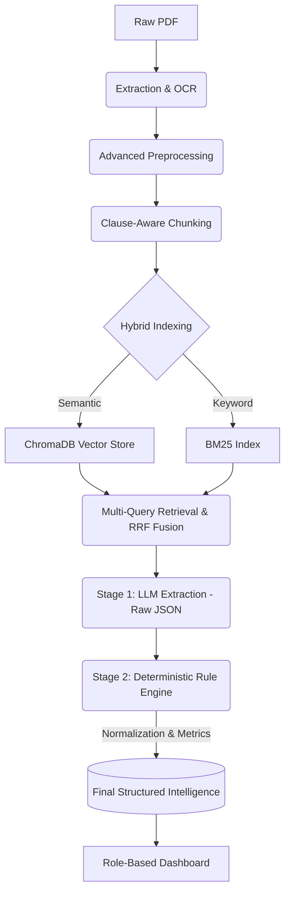

# ⚖️ Contract Intelligence Suite

<div align="center">
  <em>An AI-powered pipeline that converts unstructured legal PDFs into structured, validated JSON and delivers role-based actionable intelligence.</em>
</div>

---

## 📑 Table of Contents
- [Overview](#-overview)
- [System Architecture (The Pipeline)](#-system-architecture-the-pipeline)
- [Key Features & Capabilities](#-key-features--capabilities)
- [Under the Hood: Technical Modules](#-under-the-hood-technical-modules)
  - [1. Advanced Document Preprocessing](#1-advanced-document-preprocessing)
  - [2. Clause-Aware Chunking & Hybrid Indexing](#2-clause-aware-chunking--hybrid-indexing)
  - [3. Multi-Query Retrieval & Two-Stage Extraction](#3-multi-query-retrieval--two-stage-extraction)
  - [4. Deterministic Post-Processing Engine](#4-deterministic-post-processing-engine)
- [Performance Benchmarking & Metrics](#-performance-benchmarking--metrics)
- [Role-Based Insights (Frontend)](#-role-based-insights-frontend)
- [Technology Stack](#-technology-stack)
- [Getting Started](#-getting-started)
- [API Reference](#-api-reference)

---

## 🚀 Overview

The **Contract Intelligence Suite** solves the "messy legal data" problem. Traditional OCR and raw LLM extraction often lead to hallucinations, missed clauses, and unstructured data blocks. 

This project uses a highly engineered **Retrieval-Augmented Generation (RAG)** pipeline combined with **Deterministic Post-Processing** to extract high-fidelity legal intelligence from PDFs. It identifies contract types, extracts entities, normalizes commercial terms, and flags legal risks — transforming unstructured documents into searchable, analytics-ready structured data.

---

## 🏛 System Architecture (The Pipeline)

The system processes documents through a multi-layered, end-to-end pipeline:



---

## ✨ Key Features & Capabilities

- **Automatic Classification:** Identifies contract variants (e.g., Service Agreement, NDA, Lease).
- **Deep Entity Extraction:** Extracts parties, jurisdiction, governing law, and key commercial terms (payment, liability limits, notice periods).
- **Clause Detection:** Boolean flagging for Critical clauses like Non-Compete, Non-Solicitation, and Audit Rights.
- **Rule-Based Risk Engine:** Automatically assigns a Risk Score (0-100) and severity based on missing clauses or unfavorable terms (e.g., "Unlimited Liability").
- **Evidence Mapping:** Every extracted value is mapped to a specific `evidence_id` tied to the source paragraph, ensuring zero ungrounded hallucinations.
- **Batch Processing:** Async queue system to process dozens of contracts simultaneously.

---

## ⚙️ Under the Hood: Technical Modules

### 1. Advanced Document Preprocessing
Before the AI sees the text, the document undergoes rigorous programmatic cleaning:
- **Header/Footer & Signature Stripping:** Regex-based removal of "Page X of Y", confidential stamps, and signature blocks to prevent retrieval noise.
- **OCR Noise Cleaning:** Resolves common visual confusions (`l` vs `1`, `O` vs `0`).
- **Layout Normalization:** Joins hyphenated words across lines, merges multi-column gaps, and fixes soft sentence breaks.
- **Cross-Reference Resolution:** Tags explicit section references (e.g., "as per Section 4.2") with a `[CROSS_REF]` marker.
- **Defined Terms Resolution:** Maps capitalized terms back to their definitional context.

### 2. Clause-Aware Chunking & Hybrid Indexing
Unlike naive algorithms that split text arbitrarily, the system uses **Semantic Legal Units**:
- **Clause Detection:** Carves documents exactly at Article/Section boundaries (e.g., `ARTICLE IV`, `1.1 Payment`).
- **Hybrid Search Strategy:** 
  - Generates 384-dimensional embeddings stored in **ChromaDB** for meaning-based search.
  - Builds an on-the-fly **BM25** keyword index for exact legal jargon matching.

### 3. Multi-Query Retrieval & Two-Stage Extraction
- **RRF Fusion:** Queries are run against both Vector and BM25 indexes. The results are merged using Reciprocal Rank Fusion (RRF) to get the Top-K chunks.
- **Hybrid LLM Pipeline:**
  - **Stage 1 (JSON Extraction):** Powered by **OpenAI GPT-5 Nano** forced via `json_object` format to extract verbatim quotes and page numbers with ultra-low latency.
  - **Classification & Other Tasks:** Powered by **Groq** (Llama 3) for high-speed abstract classification.

### 4. Deterministic Post-Processing Engine
The messy LLM data is then passed to a strictly typed Python layer:
- **Normalization:** RegEx converts "Net 30" to `{"due_days": 30}` and currency strings to float values.
- **Risk Assessment:** Deterministic penalties (e.g., +50 points for unlimited liability).
- **Output Validation:** Pydantic models enforce the final JSON schema structure.

---

## 📊 Performance Benchmarking & Metrics

The suite evaluates its own performance on every execution:
- **Confidence Scoring:** Combines the LLM's self-reported probability with structural validation (e.g., dropping scores if no text snippet is returned).
- **Grounding Score:** The percentage of extracted values backed by a valid, verifiable quote (`evidence_id`) from the PDF.
- **Weighted Loss Metric:** A synthesized metric: `0.5 * (1 - F1) + 0.3 * (1 - Grounding) + 0.2 * (1 - AvgConfidence)` used for system tuning.
- *Optional Ground Truth Eval:* Can run precision, recall, and F1 comparisons against human-annotated datasets.

---

## 🧑‍💻 Role-Based Insights (Frontend)

The React-based Single Page Application (SPA) transforms the JSON output into four tailored perspectives:

1. **⚖️ Legal View:** Row-by-row breakdown of clauses, raw excerpts, and extraction confidence.
2. **🧑‍💼 Business View:** Immediate access to commercial terms (payments, dates, liability multipliers).
3. **🛡️ Compliance View:** Highlights "Missing Safeguards" and the overall Risk Meter.
4. **💼 Executive View:** A high-level contract abstract detailing total parties, risk severity, and top 3 issues requiring action.

---

## 🛠 Technology Stack

- **Backend / AI Engine:**
  - `FastAPI` / `Uvicorn` — High-performance async API
  - **Hybrid AI Engine:**
    - `OpenAI` API (GPT-5 Nano) — Specialized for strict JSON extraction and schema adherence.
    - `Groq` API (Llama-3.3-70b-versatile) — High-speed inference for general classification tasks.
  - `ChromaDB` — Vector store
  - `sentence-transformers`, `rank_bm25` — Retrieval stack
  - `pdfplumber`, `PyMuPDF` (fitz), `pytesseract` — PDF ingestion tools
  - `Pydantic` — Data validation

- **Frontend:**
  - `React` (Vite)
  - Vanilla CSS with Glassmorphism/Dark Theme

---

## 🚦 Getting Started

### 1. Prerequisites
- Python 3.9+
- Node.js 18+
- OpenAI API Key
- Groq API Key

### 2. Standard Environment Setup

**Backend:**
```bash
cd backend
python -m venv venv

# Windows
venv\Scripts\activate
# Mac/Linux
source venv/bin/activate

pip install -r requirements.txt
cp .env.example .env 
# Add OPENAI_API_KEY and GROQ_API_KEY to your .env file

uvicorn app.main:app --reload --port 8000
```

**Frontend:**
```bash
cd frontend
npm install
npm run dev
```

Dashboard available at: **http://localhost:5173**

---

## 🔌 API Reference

The backend ships with interactive Swagger documentation available at `http://localhost:8000/api/docs`. 

**Key Endpoints:**
- `POST /api/contracts/upload` — Upload and process a single PDF.
- `POST /api/contracts/batch` — Process all PDFs awaiting in `data/contracts/`.
- `GET /api/contracts/results/{contract_id}` — Retrieve the fully vetted `ContractOutput` JSON.
- `GET /api/intelligence/{role}-view/{contract_id}` — Fetch a transformed, role-specific abstract (legal, business, compliance, executive).

---

> **Note:** This suite prioritizes reducing AI hallucinations by strictly enforcing verification pipelines and treating the LLM as an extraction parser rather than an analysis oracle.
